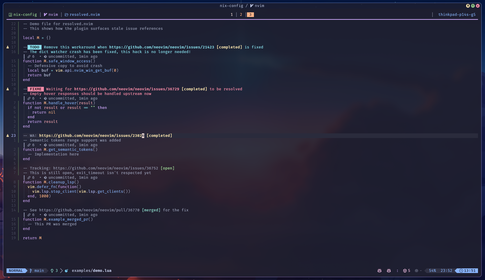
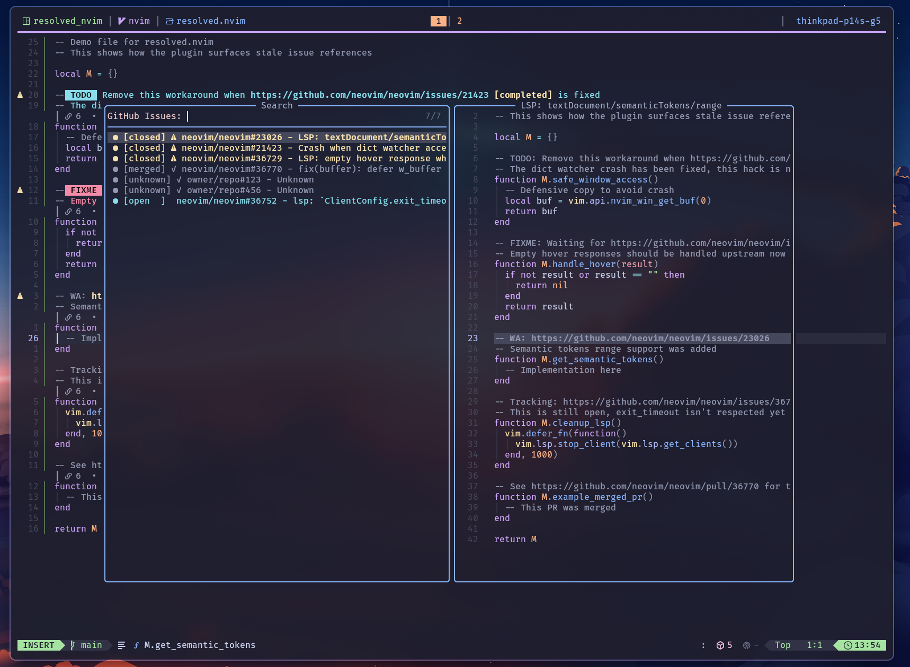

# 🔍 `resolved.nvim`

**resolved.nvim** surfaces stale issue and PR references in your code.
When a GitHub issue you're working around gets closed, resolved.nvim lets you know it's time to clean up.



## ✨ Features

- **🔔 Stale Reference Detection**
  - ⚠️ **Gutter Signs**: Visual indicators for workarounds that can be removed
  - 🎨 **Inline Status**: Shows `[completed]`, `[open]`, or `[merged]` after URLs
  - 🔆 **URL Highlighting**: Stale URLs bold in warning color, closed URLs italic

- **🔎 Smart Scanning**
  - 🌳 **Treesitter-Powered**: Finds URLs in comments across all major languages
  - 🏷️ **Keyword Detection**: Identifies TODO/FIXME/HACK markers to flag stale workarounds
  - ⚡ **Debounced Updates**: Efficient scanning that won't slow you down

- **📋 Issue Picker**
  - 🗂️ **Workspace Overview**: Browse all referenced issues across your codebase
  - 🔗 **Quick Navigation**: Jump to references or open issues in your browser



## 📋 Requirements

- **Neovim** `>= 0.10`
- [GitHub CLI](https://cli.github.com/) (`gh`) - must be authenticated
- [plenary.nvim](https://github.com/nvim-lua/plenary.nvim)
- [nvim-treesitter](https://github.com/nvim-treesitter/nvim-treesitter) _(recommended)_
- [snacks.nvim](https://github.com/folke/snacks.nvim) for enhanced picker _(optional)_

## 🚀 Quick Start

1. **Install** the plugin with your package manager (see below)
2. **Authenticate GitHub CLI**: `gh auth login`
3. **Check health**: `:checkhealth resolved`
4. **Try it out**: Open a file with GitHub issue URLs in comments

> [!TIP]
> Run `:checkhealth resolved` after installation to verify your setup.

## 📦 Installation

Install with [lazy.nvim](https://github.com/folke/lazy.nvim):

```lua
{
  "noamsto/resolved.nvim",
  dependencies = { "nvim-lua/plenary.nvim" },
  event = "VeryLazy",
  opts = {},
}
```

<details>
<summary>packer.nvim</summary>

```lua
use {
  "noamsto/resolved.nvim",
  requires = { "nvim-lua/plenary.nvim" },
  config = function()
    require("resolved").setup()
  end,
}
```

</details>

## ⚙️ Configuration

<details>
<summary>Default settings</summary>

```lua
require("resolved").setup({
  -- Enable on startup
  enabled = true,

  -- Cache TTL in seconds
  cache_ttl = 300,

  -- Debounce delay for buffer scanning
  debounce_ms = 500,

  -- Include pull requests (not just issues)
  include_prs = true,

  -- Keywords indicating workarounds (triggers "stale" when issue closes)
  stale_keywords = {
    "TODO", "FIXME", "HACK", "XXX", "WA",
    "workaround", "temporary", "temp", "WIP",
    "blocked", "waiting", "upstream",
  },

  -- Per-filetype treesitter node types to search
  filetypes = {
    lua = { node_types = { "comment" } },
    python = { node_types = { "comment", "string" } },
    rust = { node_types = { "line_comment", "block_comment" } },
    markdown = { node_types = { "inline" } },
    -- Disable for a filetype:
    -- json = false,
    -- Fallback for unlisted filetypes:
    ["*"] = { node_types = { "comment" } },
  },

  -- Show gutter signs for stale references
  signs = true,

  -- Icons
  icons = {
    stale = "⚠",
    stale_sign = "⚠",
    open = "",
  },

  -- Highlight groups
  highlights = {
    stale = "DiagnosticWarn",
    stale_sign = "DiagnosticWarn",
    stale_url = "ResolvedStaleUrl",
    closed = "DiagnosticHint",
    closed_url = "ResolvedClosedUrl",
    open = "DiagnosticOk",
  },

  -- Icon provider: "mini", "devicons", or false for defaults
  icon_provider = false,
})
```

</details>

## 🚀 Commands

```
:Resolved <Tab>    → show all subcommands
```

| Command                 | Description                     |
| ----------------------- | ------------------------------- |
| `:Resolved`             | Show plugin status              |
| `:Resolved enable`      | Enable the plugin               |
| `:Resolved disable`     | Disable the plugin              |
| `:Resolved toggle`      | Toggle enabled state            |
| `:Resolved refresh`     | Refresh current buffer          |
| `:Resolved clear_cache` | Clear the issue status cache    |
| `:Resolved issues`      | Open picker with all issues/PRs |

## 📟 Lua API

```lua
local resolved = require("resolved")

resolved.is_enabled()  -- Check if enabled
resolved.enable()      -- Enable
resolved.disable()     -- Disable
resolved.toggle()      -- Toggle
resolved.refresh()     -- Refresh current buffer
resolved.refresh_all() -- Refresh all visible buffers
resolved.clear_cache() -- Clear cache

-- Picker (requires snacks.nvim or falls back to vim.ui.select)
require("resolved.picker").show_issues_picker()
```

## 🔌 Integrations

<details>
<summary>snacks.nvim toggle</summary>

```lua
{
  "noamsto/resolved.nvim",
  dependencies = { "nvim-lua/plenary.nvim" },
  event = "VeryLazy",
  opts = {},
  config = function(_, opts)
    require("resolved").setup(opts)
    Snacks.toggle.new({
      name = "Resolved",
      get = function()
        return require("resolved").is_enabled()
      end,
      set = function(state)
        if state then
          require("resolved").enable()
        else
          require("resolved").disable()
        end
      end,
    }):map("<leader>uR")
  end,
}
```

</details>

## 🏷️ Tier System

| Tier       | Condition                  | Display                                |
| ---------- | -------------------------- | -------------------------------------- |
| **Stale**  | Closed/merged + keywords   | ⚠ gutter sign, bold URL, `[completed]` |
| **Closed** | Closed/merged, no keywords | Italic URL, `[closed]` in hint color   |
| **Open**   | Still open or "not_planned"| `[open]` in green                      |

> [!NOTE]
> Issues closed as "not_planned" (won't fix) are treated as open—your workaround is still needed.

## 🤔 Why Keywords Matter

Not every closed issue reference is stale. Documentation references remain valid.

But when your comment says `TODO: remove when #123 is fixed` and #123 is now closed—you want to know. That's what stale keywords detect.

## 🔒 Security

This plugin takes security seriously. All external commands are executed safely via plenary.job with proper argument separation and timeouts. URLs are validated before processing.

See [SECURITY.md](docs/SECURITY.md) for details. If you discover a vulnerability, please see our [security policy](docs/SECURITY.md#reporting-a-vulnerability).

## 🧪 Development

<details>
<summary>Running tests</summary>

Tests use [plenary.nvim](https://github.com/nvim-lua/plenary.nvim):

```bash
# Run all tests
nvim --headless -c "lua require('plenary.busted').run('tests/resolved/')" -c "qa"

# Run specific test file
nvim --headless -c "lua require('plenary.busted').run('tests/resolved/patterns_spec.lua')" -c "qa"
```

</details>

<details>
<summary>Test coverage</summary>

- URL pattern extraction and validation
- Multi-line comment handling
- Async operation race conditions
- Buffer validity checks
- Configuration validation
- Timer lifecycle management

</details>

## 📝 TODO

- [ ] lualine.nvim integration (show stale issue count in statusline)
- [ ] telescope.nvim picker integration

## 📄 License

MIT
